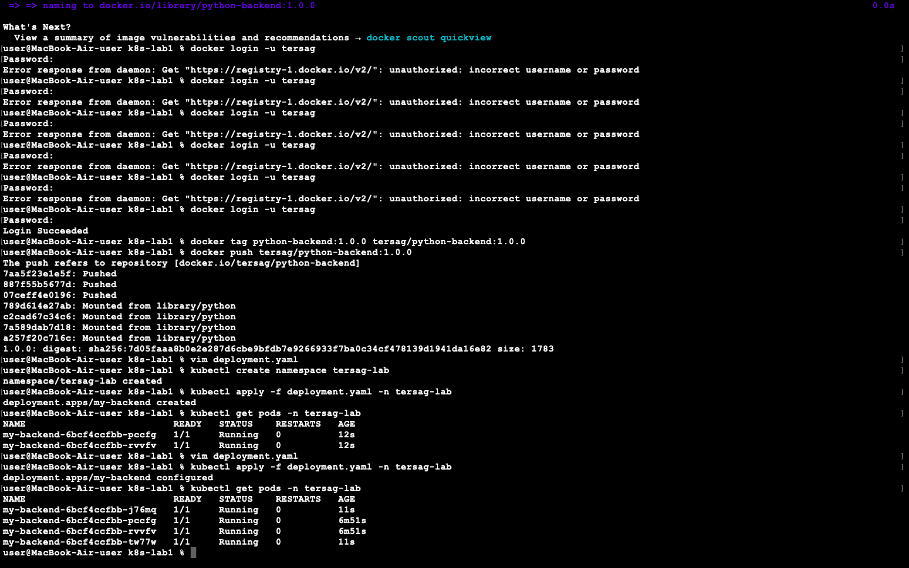
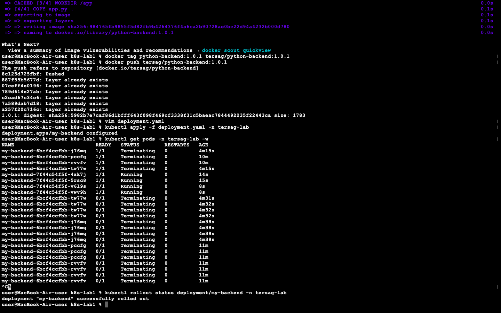

# Лабораторна робота: Kubernetes — перший деплоймент

## Результати виконання завдань

### Завдання 1 та 2: Перший деплоймент і Масштабування (Scaling)
Образ було зібрано, завантажено на Docker Hub та розгорнуто в кластері Kubernetes. Спочатку конфігурація `deployment.yaml` запустила 2 репліки додатка. 
Після цього кількість реплік було змінено з 2 на 4. Kubernetes автоматично виявив різницю між поточним та бажаним станом і достворив ще 2 контейнери. На скріншоті нижче видно як перші два поди, так і нові, створені під час масштабування.

### Завдання 3: Оновлення версії (Rolling Update)
Було випущено нову версію образу (1.0.1). Kubernetes виконав поступову заміну старих контейнерів на нові (Rollout) без простою, що підтверджується статусами `Terminating` для старих подів та `Running` для нових.

