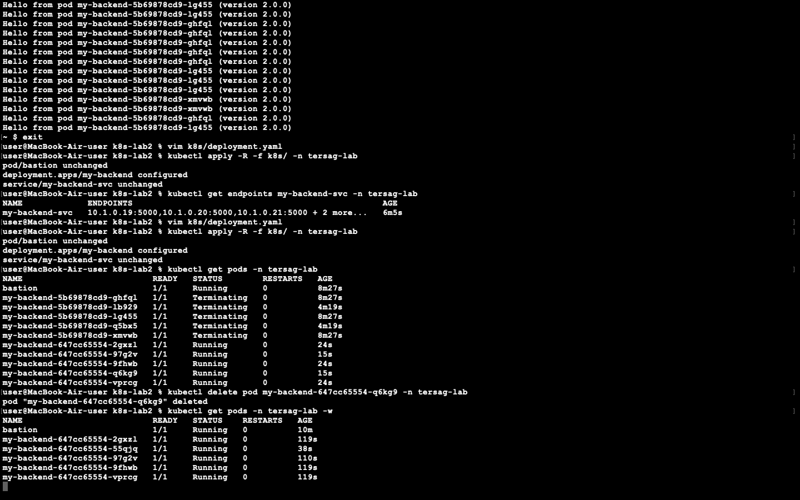

# Лабораторна робота: Kubernetes — Service та балансування навантаження

## Результати виконання

У ході лабораторної роботи було успішно налаштовано внутрішній балансувальник навантаження (ClusterIP Service) та перевірено його роботу. 

На скріншоті нижче зафіксовано виконання всіх ключових завдань:
1. **Балансування трафіку:** запити з бастіону рівномірно розподіляються між різними подами (видно по іменах подів у відповідях `curl`).
2. **Масштабування:** Service автоматично підхопив нові поди після збільшення кількості реплік до 5 (`endpoints: ... + 2 more`).
3. **Readiness Probe:** після додавання проби готовності та ручного видалення пода, Kubernetes успішно створив новий под, дочекався його повної готовності (статус 1/1) і лише після цього дозволив направляти на нього трафік.

