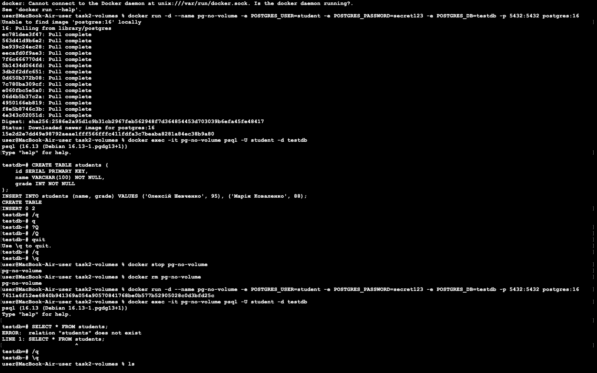
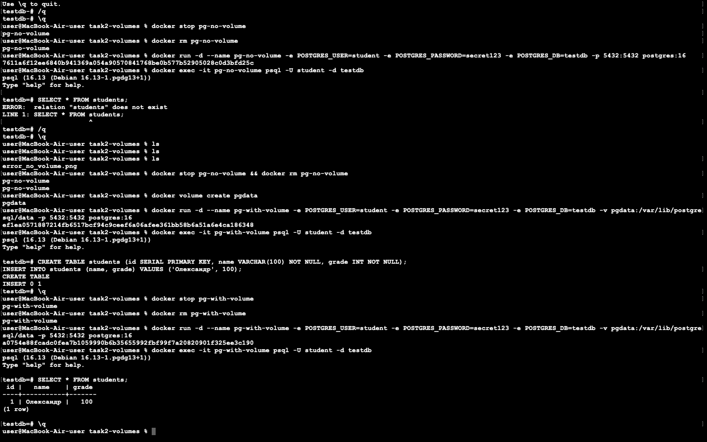

Завдання 2 - Docker Volumes (PostgreSQL)

# Результати дослідження
1.Контейнер БЕЗ Volume
При видаленні контейнера всі напрацьовані дані були втрачені. Після перестворення контейнера з тими ж параметрами таблиця з даними не знайдена:

2.Контейнер З Volume
Було створено іменований volume `pgdata`. Після створення таблиці, видалення контейнера та його повторного запуску з тим самим volume, усі записи в базі даних успішно збереглися:

