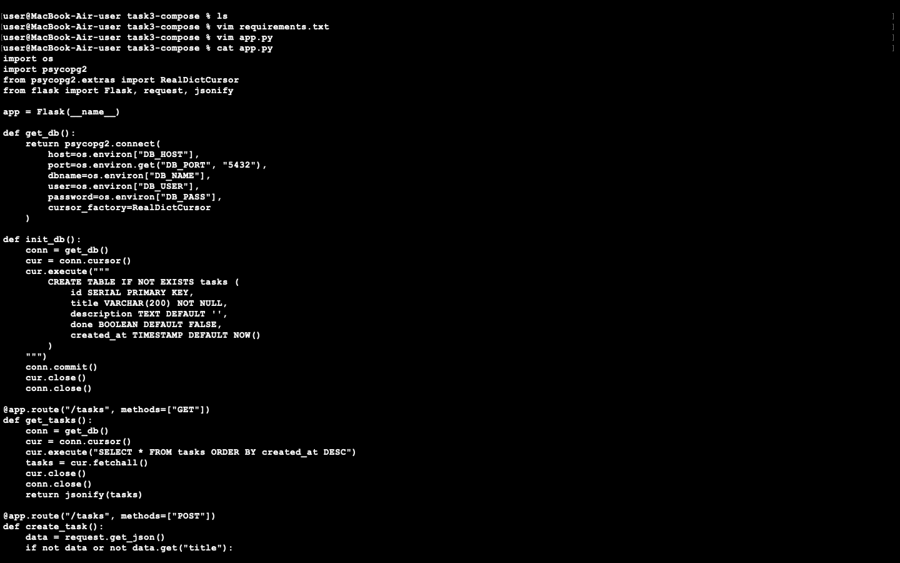
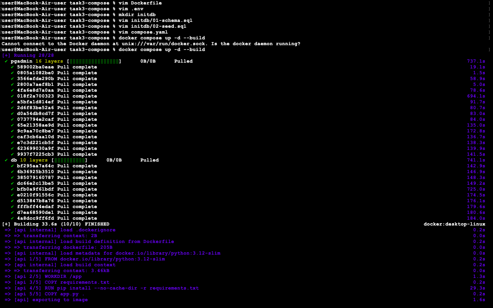
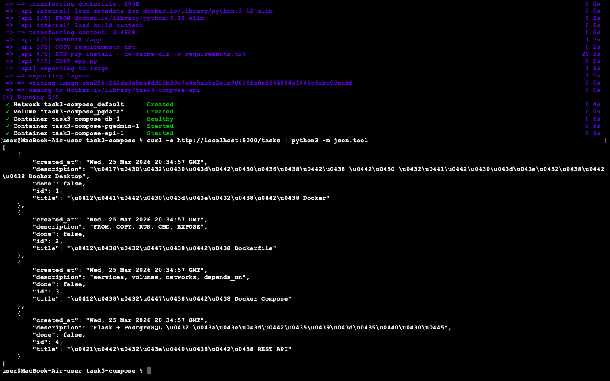
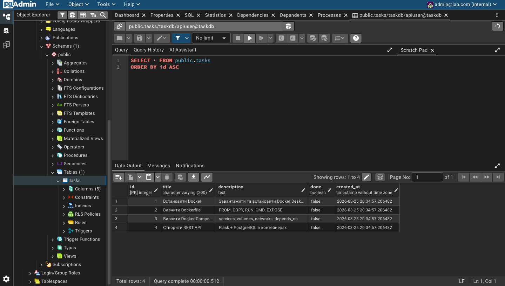
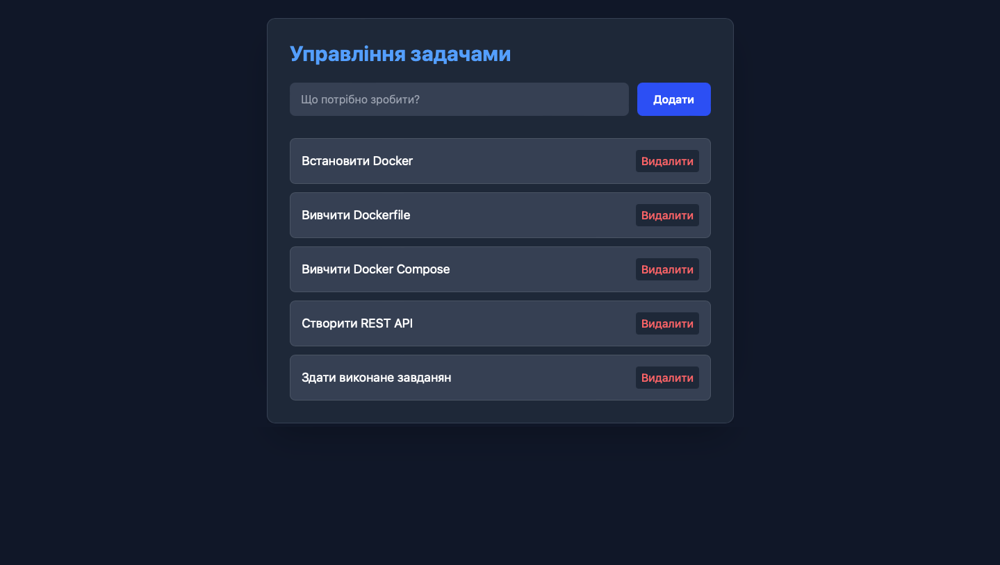

# Завдання 3 - Docker Compose (REST API + PostgreSQL + pgAdmin)

---

## Хід виконання та результати

### 1. Підготовка коду та конфігурації
Було створено всі необхідні файли (`Dockerfile`, `compose.yaml`, `.env`), SQL-скрипти для ініціалізації та сам код сервера `app.py`:

### 2. Збірка та запуск
За допомогою команди `docker compose up -d --build` було успішно зібрано образ для API та запущено всі три контейнери. Механізм `healthcheck` дочекався повної готовності бази даних перед запуском API:

### 3. Перевірка REST API
Запит `curl` до сервера `http://localhost:5000/tasks` успішно повернув дані у форматі JSON. Це підтверджує, що API працює, а стартові SQL-скрипти успішно наповнили базу даними:

### 4. Веб-інтерфейс pgAdmin
Для візуального керування базою даних було налаштовано підключення через pgAdmin (порт 8888):

Після авторизації та підключення до хоста `db`, ми бачимо створену таблицю `tasks` із завантаженими тестовими даними:

---

## Відповіді на контрольні запитання

**1. Навіщо потрібен named volume `pgdata`? Що станеться при `down` та `down -v`?**
Volume зберігає базу даних на жорсткому диску хоста. При `docker compose down` контейнери видаляються, але volume залишається (дані збережені). При `docker compose down -v` видаляється і контейнер, і volume — дані безповоротно втрачаються.

**2. Чому `COPY requirements.txt` йде перед `COPY app.py`? Що дає `--no-cache-dir`?**
Це робиться для оптимізації через кешування шарів. Код змінюється часто, а бібліотеки рідко. Такий порядок дозволяє Docker не качати бібліотеки заново при кожній зміні коду. `--no-cache-dir` забороняє зберігати інсталяційні архіви, зменшуючи вагу фінального образу.

**3. Чому `DB_HOST` = `db`, а не `localhost`?**
Усі контейнери в compose-файлі знаходяться у власній віртуальній мережі Docker. У цій мережі вони звертаються один до одного за іменами сервісів (у нашому випадку сервіс бази називається `db`).

**4. Що відбудеться, якщо прибрати `healthcheck` і `condition: service_healthy`?**
API-сервер запуститься одночасно з базою. Оскільки базі потрібен час на ініціалізацію, API не зможе до неї підключитися і просто впаде з помилкою. Healthcheck змушує API почекати.

**5. Чому `.env` не треба вказувати в compose-файлі явно? Як зробити різні середовища?**
Docker Compose за замовчуванням автоматично шукає файл з іменем `.env` у поточній папці. Для різних середовищ створюють файли на кшталт `.env.dev` чи `.env.prod` і запускають систему командою `docker compose --env-file .env.prod up -d`.

**6. Коли виконуються скрипти з `/docker-entrypoint-initdb.d/`?**
Вони автоматично виконуються тільки один раз — при найпершому запуску PostgreSQL, коли його папка для даних (`volume`) абсолютно порожня. Префікси `01-` та `02-` задають алфавітний порядок виконання. Якщо дані вже існують, ці скрипти ігноруються.

### 5. Виконання Завдання 4: Додавання Frontend-компонента
До існуючої архітектури було додано клієнтську частину (веб-сайт). 
Для реалізації було виконано такі кроки:
1. **API:** Додано бібліотеку `flask-cors` та налаштовано CORS у Flask-сервері, щоб дозволити браузеру робити крос-доменні запити з фронтенду до API.
2. **UI:** Створено красивий адаптивний інтерфейс за допомогою HTML, JavaScript (Fetch API) та Tailwind CSS.
3. **Контейнеризація:** Написано окремий `Dockerfile` для фронтенду на базі легкого веб-сервера `nginx:alpine`.
4. **Оркестрація:** Сервіс `frontend` додано до `compose.yaml` із прокиданням порту `8080:80` та залежністю від `api`.

**Результат:** Повноцінно працюючий Fullstack-додаток, де фронтенд успішно взаємодіє з базою даних через REST API.

---
